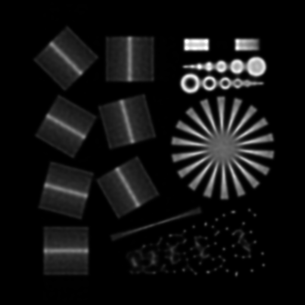

# DeconvOptim.jl

An framework for fast deconvolution of images convolved with a Point Spread Function (PSF).


## Overview
In optics, especially in microscopy, measurements are performed with lenses. These lenses support only certain frequencies
and weaken the contrast of high frequency content. Furthermore in many cases Poisson or Gaussian noise is introduced by the 
quantum nature of light (Poisson shot noise) or sensors (readout noise).
[DeconvOptim.jl](https://github.com/roflmaostc/DeconvOptim.jl) is a Julia solution to that deconvolution process.
Our framework relies on several other tools:
The deconvolution problem is stated as a convex optimization problem (loss function). Hence we make use of [Optim.jl](https://github.com/JuliaNLSolvers/Optim.jl/) and especially fast solvers like [L-BFGS](https://julianlsolvers.github.io/Optim.jl/stable/#algo/lbfgs/).
Since such solvers require gradients (of the loss function) we use the automatic differentiation (AD) of [Zygote.jl](https://github.com/FluxML/Zygote.jl) for that.
Of course, one could derive the gradient by hand, however that's error-prone and for some regularizers hard to do by hand.
Furthermore, fast AD of the regularizers are hard to achieve if the gradients are written with for loops.
Fortunately [Tullio.jl](https://github.com/mcabbott/Tullio.jl) provides an extensive and fast framework to get expressions which can derived by the AD in acceptable speed.


## Installation
To get the latest stable release of DevonOptim.jl type `]` in the Julia REPL:
```
] add DeconvOptim
```


## Quick Example
Below is a quick example how to deconvolve a image which is blurred with a Gaussian Kernel.

```@example
using DeconvOptim, TestImages

# load test images
img = channelview(testimage("fabio_gray"))

# create a Gaussian blur kernel (not very sophisticated for a real lens)
dist = [sqrt((i - size(img)[1] / 2)^2 + (j - size(img)[2] / 2)^2)
            for i = 1:size(img)[1],  j = 1:size(img)[2]]
psf = ifftshift(exp.(-dist .^2 ./ 4.0 .^2))
# normalize the sum
psf ./= sum(psf)

# create a blurred, noisy version of that image
img_b = conv_psf(img, psf, [1, 2])
img_n = poisson(img_b, 300)

img_n ./= maximum(img_n)

# define a Good's Roughness regularizer
reg = DeconvOptim.GR(sum_dims=[1, 2], weights=[1, 1], λ=0.05, mode="central", step=1)
# deconvolve
res, o = deconvolution(img_n, psf, iterations=10,
        lossf=Poisson(), mappingf=Non_negative(), regularizerf=reg)
```


| Gray image with noise and blur |Restored image via deconvolution |
|:-------------------------------|---------------------------------|
| |    |


