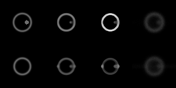

# 3D Dataset
We can also deconvolve a 3D dataset with a 3D PSF.
The workflow, especially for the regularizers, must be adapted slightly for 3D.

## Code Example
This example is also hosted in a notebook on [GitHub](https://github.com/roflmaostc/DeconvOptim.jl/blob/master/examples/3D_example.ipynb).


First, load the 3D PSF and image.
```@jldoctest
using Revise, DeconvOptim, TestImages, Images, FFTW, Noise, ImageView
img = 300 .* convert(Array{Float32}, channelview(load("obj.tif")))
psf = ifftshift(convert(Array{Float32}, channelview(load("psf.tif"))))
psf ./= sum(psf)
# create a blurred, noisy version of that image
img_b = conv_psf(img, psf, [1, 2, 3])
img_n = poisson(img_b, 300);
```
As the next step we need to create the regularizers. With `num_dims` we define how many dimensions are reconstruction image has. 
With `sum_dims` we specify which dimensions of those should be included in the regularizing process.
```@jldoctest
reg1 = TV(num_dims=3, sum_dims=[1, 2, 3])
reg2 = Tikhonov(num_dims=3, sum_dims=[1, 2, 3], mode="identity")
```

We can then invoke the deconvolution. For `Tikhonov` in the `identity` mode a smaller $\lambda$ produces better results. In the first reconstruction we also specified the `padding`. This parameters adds some spacing around the reconstruction image to prevent wrap around effects of the FFT based deconvolution. However, since we don't have bright objects at the boundary of the image we don't see an impact of that parameter.
```@jldoctest
@time res, ores = deconvolution(img, psf, regularizer=reg1, loss=Poisson(),
                          λ=0.05, padding=0.2, iterations=10);
@time res2, ores = deconvolution(img, psf, regularizer=reg2, loss=Poisson(),
                          λ=0.001, padding=0.0, iterations=10);
```

Finally we can inspect the results:
```@jldoctest
img_comb1 = [img[:, : ,32] res2[:, :, 32] res[:, :, 32] img_n[:, :, 32]]
img_comb2 = [img[:, : ,38] res2[:, :, 38] res[:, :, 38] img_n[:, :, 38]]

img_comb = cat(img_comb1, img_comb2, dims=1)
img_comb ./= maximum(img_comb)

imshow([img[:, :, 20:end] res2[:, :, 20:end] res[:, :, 20:end] img_n[:, :, 20:end]])
colorview(Gray, img_comb)
```


